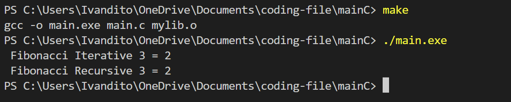

# Fibonacci

In here, I will compare the time complexity and space complexity of Fibonacci(Iterative) and Fibonacci(Recursive)

## Fibonacci Iterative

```c
int fibonacciIterative(int N){

    int F0 = 0;
    int F1 = 1;
    int F2;

    if (N == 0){
        return F0;
    }
    else if (N == 1){
        return F1;
    } 
    else {
        for(int i=2; i <= N; i++){
            F2 = F0 + F1;
            F0 = F1;
            F1 = F2;
        }
        return F2;
    }
}
```

## Fibonacci Recursive

```c
int fibonacciRecursive(int N){
    if (N == 0){
        return 0;
    }
    else if (N == 1){
        return 1;
    }
    else{
        return fibonacciRecursive(N-1) + fibonacciRecursive(N-2);
    }
}
```

# Testing

## How to run

Using command make; ./main.exe

```bash
make; ./main.exe
```

## Result



# Benchmark

A benchmark is a standard or point of reference people can use to measure something else.

# Time Complexity

## How to run

using command make time

```bash
make time
```

## Time Comparison

I use N = 40 

The time taken for iterative N = 40 is 0.000000s and for recursive N = 40 is 3.782000s

# Space Complexity

## How to run

```bash
make space
./spacecomplexityRecursive.exe
```

```bash
make space
./spacecomplexityIterative.exe
```

## Space Comparison

By Using Task Manager

N = 10000


It shows that memory usage by iterative is 300kb and memory usage by recursive is 900kb

